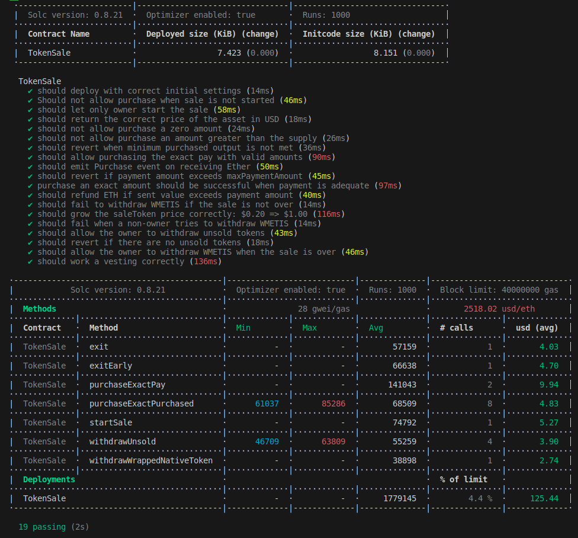

# TokenSale Project

```bash
npm install
mv .env_example .env
npm run compile
npm run test
```
## Dev docs
### TokenSale [](./docs/TokenSale.md)

## Deployed Addresses

| Network | ChainId | Contract | Address |
|---------| ------- | ---------| --------|

| METIS   | 1088    | TokenSale| [0x...not deployed yet](https://explorer.metis.io/address/0x....) |

## Tests

